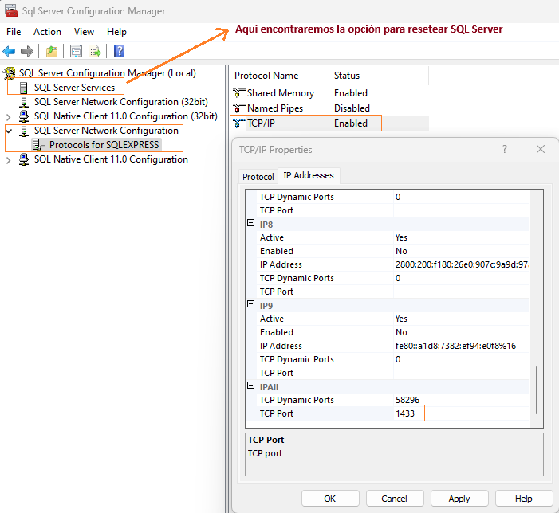
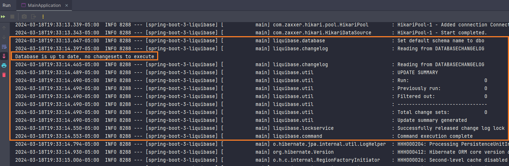
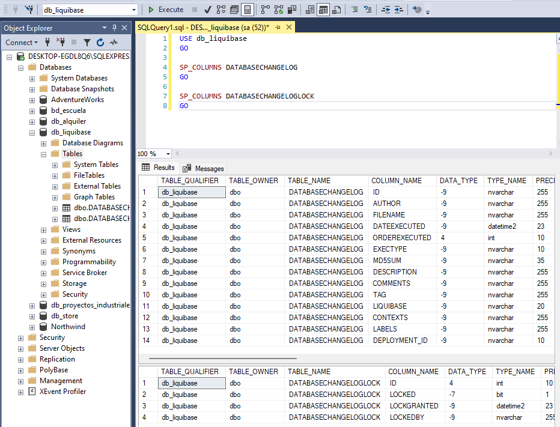
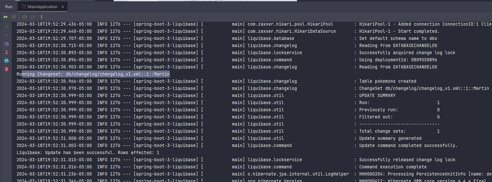
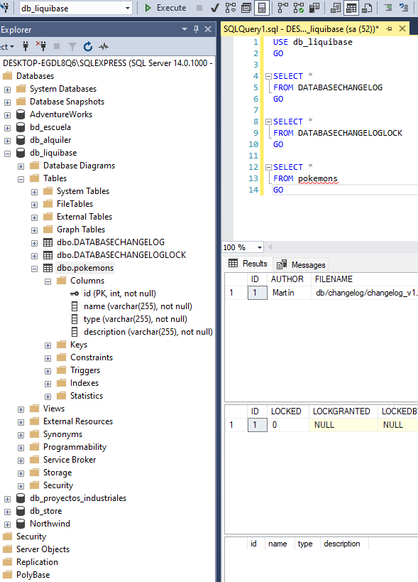
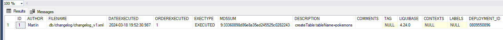
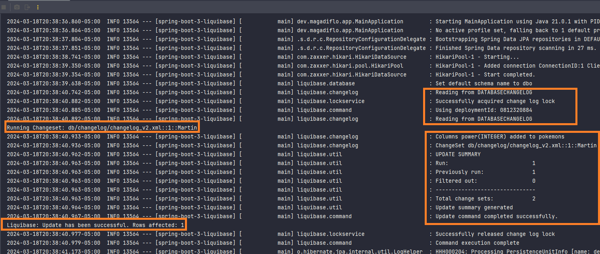
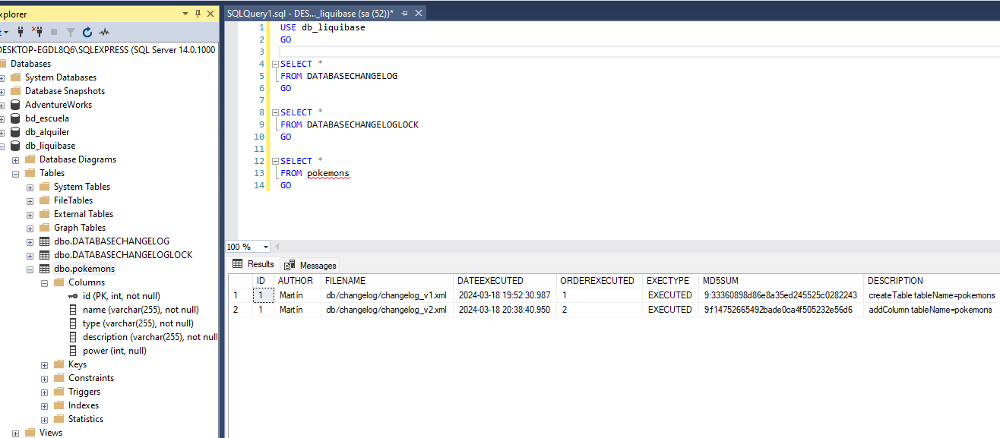

# [Spring boot 3 Liquibase](https://www.youtube.com/watch?v=vWC97p00NL4)

Tutorial tomado del canal de youtube **Shahid Foy**

---

## Spring Boot + SQL Server

Si es la primera vez que vamos a trabajar con `SQL Server` + `Spring Boot` es probable que necesitemos realizar cierta
configuración a `SQL Server` para trabajar con un puerto estático y habilitar conexiones entrantes.

Como nota adicional, **esta configuración no tiene nada que ver con `Liquibase`, sino más bien, es una configuración
para que nuestra aplicación de `Spring Boot` pueda trabajar con la base de datos** `SQL Server`.

En el siguiente apartado se muestra cómo realizar dichas configuraciones.

## Manejando la conexión  TCP/IP SQLServerException

Si ejecutamos el proyecto de Spring Boot y obtenemos el siguiente error:

````bash
com.microsoft.sqlserver.jdbc.SQLServerException: 
The TCP/IP connection to the host localhost, port 1433 has failed. 
Error: "Connection refused: no further information. Verify the connection properties. 
Make sure that an instance of SQL Server is running on the host and accepting TCP/IP connections at the port. 
Make sure that TCP connections to the port are not blocked by a firewall.".
````

Simplemente, debemos seguir estos pasos:

#### Habilitando TCP/IP

1. Abrimos `Sql Server Configuration Manager`, eso lo podemos lograr presionando `Windows + R` y
   escribir `SQLServerManager14.msc`. Como dato adicional, el comando escrito es para la versión de SQL Server estoy
   usando `Microsoft SQL Server 2017`. Si se está usando otra versión ver el siguiente enlace para usar el comando
   adecuado [SQL Server Configuration Manager](https://learn.microsoft.com/en-us/sql/relational-databases/sql-server-configuration-manager?view=sql-server-ver16&redirectedfrom=MSDN).
   <br><br>
   Otra posibilidad es ir directamente al archivo `SQLServerManager14.msc` que está ubicado en la siguiente
   ruta `C:\Windows\SysWOW64`.
2. Expanda `SQL Server Network Configuration` y seleccione `Protocols for [INSTANCE_NAME]`.
3. Clic derecho en `TCP/IP` y seleccione `Enabled`.

#### Definiendo puerto estático

1. Clic derecho en `TCP/IP` y clic en `Properties`.
2. Elija la pestaña `IP Addresses`.
3. Desplácese hacia abajo hasta el nodo `IPALL`.
4. Configure el `TCP Port` en el puerto `1433`.
5. Reinicie SQL Server Service

#### Reiniciando SQL Server

1. En la misma ventana de `Sql Server Configuration Manager` seleccionamos la opción `SQL Server Services`.
2. En el lado derecho, clic secundario a `SQL Server (SQLEXPRESS)` y `Restart`.



## Dependencias

````xml
<!--Spring Boot 3.2.3-->
<!--Java 21-->
<dependencies>
    <dependency>
        <groupId>org.springframework.boot</groupId>
        <artifactId>spring-boot-starter-data-jpa</artifactId>
    </dependency>
    <dependency>
        <groupId>org.liquibase</groupId>
        <artifactId>liquibase-core</artifactId>
    </dependency>

    <dependency>
        <groupId>com.microsoft.sqlserver</groupId>
        <artifactId>mssql-jdbc</artifactId>
        <scope>runtime</scope>
    </dependency>
    <dependency>
        <groupId>org.springframework.boot</groupId>
        <artifactId>spring-boot-starter-test</artifactId>
        <scope>test</scope>
    </dependency>
</dependencies>
````

**NOTA**

> Al agregar la dependencia `liquibase-core` desde `Spring Initilizr`, en automático nos genera el
> directorio `/db/changelog` dentro de `/resources`.

## Application.yml

A continuación se muestra las configuraciones definidas en el `application.yml`.

````yaml
server:
  port: 8080
  error:
    include-message: always

spring:
  application:
    name: spring-boot-3-liquibase

  datasource:
    url: jdbc:sqlserver://localhost:1433;databaseName=db_liquibase;encrypt=true;trustServerCertificate=true;
    username: sa
    password: magadiflo

  jpa:
    properties:
      hibernate:
        format_sql: true

  liquibase:
    change-log: classpath:db/changelog/changelog-master.xml

logging:
  level:
    org.hibernate.SQL: DEBUG
    org.hibernate.orm.jdbc.bind: TRACE
````

De las configuraciones anteriores, quizás el más importante es el
`spring.liquibase.change-log=classpath:db/changelog/changelog-master.xml`, que es un archivo con el que trabajaremos
con `liquibase`, así que ahora procedemos a crear dicho archivo en el directorio que se nos creó automáticamente:

`src/main/resources/db/changelog/changelog-master.xml`

## [Configurando changelog-master.xml](https://contribute.liquibase.com/extensions-integrations/directory/integration-docs/springboot/using-springboot-with-maven/)

Recordemos que `Liquibase` nos permite trabajar con distintos tipos de archivos `SQL`, `XML`, `JSON` y `YML`. En este
proyecto trabajaremos con `XML`, es por eso que creamos el archivo `changelog-master.xml`.

Agregamos el siguiente contenido a dicho archivo:

````xml
<?xml version="1.0" encoding="UTF-8"?>
<databaseChangeLog
        xmlns="http://www.liquibase.org/xml/ns/dbchangelog"
        xmlns:xsi="http://www.w3.org/2001/XMLSchema-instance"
        xmlns:ext="http://www.liquibase.org/xml/ns/dbchangelog-ext"
        xmlns:pro="http://www.liquibase.org/xml/ns/pro"
        xsi:schemaLocation="http://www.liquibase.org/xml/ns/dbchangelog
        http://www.liquibase.org/xml/ns/dbchangelog/dbchangelog-latest.xsd
        http://www.liquibase.org/xml/ns/dbchangelog-ext http://www.liquibase.org/xml/ns/dbchangelog/dbchangelog-ext.xsd
        http://www.liquibase.org/xml/ns/pro http://www.liquibase.org/xml/ns/pro/liquibase-pro-latest.xsd">

</databaseChangeLog>
````

## Ejecutando aplicación

Hasta este punto ejecutamos la aplicación y vemos lo siguiente:

1. En consola nos muestra el siguiente log:<br><br>
   


2. En la base de datos de SQL Server vemos dos tablas generadas:<br><br>
   

## Primera migración: Creando tabla pokemons

Vamos a crear un nuevo archivo llamado `changelog_v1.xml` donde vamos a definir un `<changeSet></changeSet>`. Este nuevo
archivo tendrá los datos necesarios para crear la tabla `pokemons` en la base de datos:

````xml
<?xml version="1.0" encoding="UTF-8"?>
<databaseChangeLog
        xmlns="http://www.liquibase.org/xml/ns/dbchangelog"
        xmlns:xsi="http://www.w3.org/2001/XMLSchema-instance"
        xmlns:ext="http://www.liquibase.org/xml/ns/dbchangelog-ext"
        xmlns:pro="http://www.liquibase.org/xml/ns/pro"
        xsi:schemaLocation="http://www.liquibase.org/xml/ns/dbchangelog
        http://www.liquibase.org/xml/ns/dbchangelog/dbchangelog-latest.xsd
        http://www.liquibase.org/xml/ns/dbchangelog-ext http://www.liquibase.org/xml/ns/dbchangelog/dbchangelog-ext.xsd
        http://www.liquibase.org/xml/ns/pro http://www.liquibase.org/xml/ns/pro/liquibase-pro-latest.xsd">
    <changeSet id="1" author="Martín">
        <createTable tableName="pokemons">
            <column name="id" type="INTEGER">
                <constraints primaryKey="true"/>
            </column>
            <column name="name" type="VARCHAR(255)">
                <constraints nullable="false"/>
            </column>
            <column name="type" type="VARCHAR(255)">
                <constraints nullable="false"/>
            </column>
            <column name="description" type="VARCHAR(255)">
                <constraints nullable="false"/>
            </column>
        </createTable>
    </changeSet>
</databaseChangeLog>
````

Ahora, para que este archivo se pueda ejecutar debemos incluirlo en el archivo `changelog-master.xml`:

````xml
<?xml version="1.0" encoding="UTF-8"?>
<databaseChangeLog
        xmlns="http://www.liquibase.org/xml/ns/dbchangelog"
        xmlns:xsi="http://www.w3.org/2001/XMLSchema-instance"
        xmlns:ext="http://www.liquibase.org/xml/ns/dbchangelog-ext"
        xmlns:pro="http://www.liquibase.org/xml/ns/pro"
        xsi:schemaLocation="http://www.liquibase.org/xml/ns/dbchangelog
        http://www.liquibase.org/xml/ns/dbchangelog/dbchangelog-latest.xsd
        http://www.liquibase.org/xml/ns/dbchangelog-ext http://www.liquibase.org/xml/ns/dbchangelog/dbchangelog-ext.xsd
        http://www.liquibase.org/xml/ns/pro http://www.liquibase.org/xml/ns/pro/liquibase-pro-latest.xsd">

    <include file="/db/changelog/changelog_v1.xml"/>
</databaseChangeLog>
````

## Ejecutando aplicación

Si ejecutamos con estas nuevas configuraciones, como resultado debemos tener creado la tabla `pokemons` en la base de
datos con las columnas que hemos definido en el archivo `changelog_v1.xml`:

A continuación se muestra el log generado en el ide:



Ahora, si revisamos la base de datos vemos que la tabla `pokemons` se ha creado correctamente y además las tablas
`DATABASECHANGELOG` y `DATABASECHANGELOGLOCK` tienen valores propios de la migración realizada:



Veamos la información completa de la tabla `DATABASECHANGELOG`, donde podemos ver el id, el autor, qué archivo
se ha ejecutado, qué es lo que se está haciendo, etc.:



## Segunda migración: Agregando nueva columna a tabla pokemons

En la siguiente migración, lo que haremos será agregar una nueva columna a la tabla `pokemons` que ya está creada
en la base de datos, así que en el archivo `changelog_v2.xml` usamos el siguiente código:

````xml
<?xml version="1.0" encoding="UTF-8"?>
<databaseChangeLog
        xmlns="http://www.liquibase.org/xml/ns/dbchangelog"
        xmlns:xsi="http://www.w3.org/2001/XMLSchema-instance"
        xmlns:ext="http://www.liquibase.org/xml/ns/dbchangelog-ext"
        xmlns:pro="http://www.liquibase.org/xml/ns/pro"
        xsi:schemaLocation="http://www.liquibase.org/xml/ns/dbchangelog
        http://www.liquibase.org/xml/ns/dbchangelog/dbchangelog-latest.xsd
        http://www.liquibase.org/xml/ns/dbchangelog-ext http://www.liquibase.org/xml/ns/dbchangelog/dbchangelog-ext.xsd
        http://www.liquibase.org/xml/ns/pro http://www.liquibase.org/xml/ns/pro/liquibase-pro-latest.xsd">
    <changeSet id="1" author="Martín">
        <addColumn catalogName="db_liquibase" schemaName="dbo" tableName="pokemons">
            <column name="power" type="INTEGER">
                <constraints nullable="true"/>
            </column>
        </addColumn>
    </changeSet>
</databaseChangeLog>
````

## Ejecutando la aplicación

Vemos en el log del ide:



Finalmente, vemos en SQL Server que la nueva columa configurada se ha creado exitosamente:

